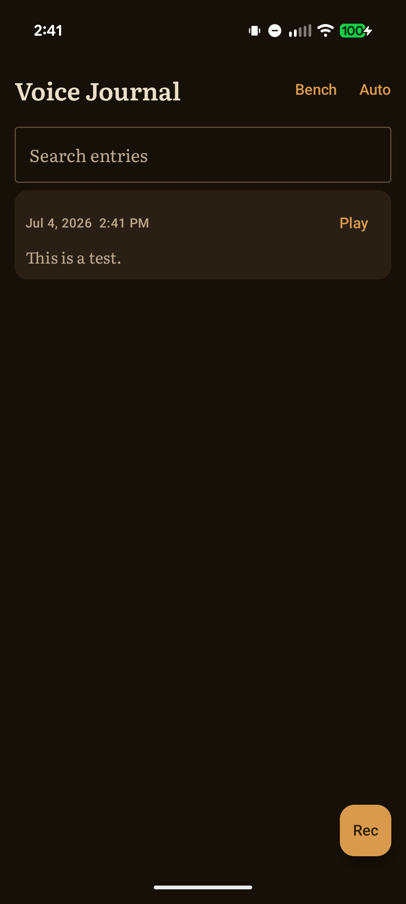

# Voice Journal

A fully offline voice journal for Android. Record your thoughts, get them transcribed on-device, and search them by meaning, not just keywords. Nothing ever leaves your phone.



## Why offline matters

A journal is one of the most private things a person owns. This app has **no INTERNET permission**. Not "we don't upload your data," but "the OS will not let this app touch the network." Check for yourself:

- Source: [`AndroidManifest.xml`](app/src/main/AndroidManifest.xml) declares `RECORD_AUDIO` and nothing else
- Built APK: `aapt dump permissions <apk>` shows the same

Transcription runs locally through [whisper.cpp](https://github.com/ggerganov/whisper.cpp) (base.en, q5_1). Semantic search runs locally through [bge-small-en-v1.5](https://huggingface.co/BAAI/bge-small-en-v1.5) (int8 ONNX). Your recordings, transcripts, and embeddings live in app-private storage.

## Performance

Measured on a Pixel 10 Pro XL at commit `e216af7`. Raw data: [`vj-benchmark-e216af7.json`](vj-benchmark-e216af7.json).

| Operation | Median | Notes |
|---|---|---|
| Transcribe 10s clip | 1.53 s | 0.153x realtime |
| Transcribe 30s clip | 1.71 s | 0.057x realtime |
| Transcribe 60s clip | 3.25 s | 0.054x realtime |
| Embed a typical entry (163 chars) | 7 ms | |
| Semantic search, 5,000 entries | 11 ms | brute-force cosine, top 20 |

A one-minute entry is searchable text in about three seconds. Search stays instant at journal scale, which is why there is no vector database in this app.

## Building

Requirements:

- Android Studio (latest stable)
- Via SDK Manager: Android SDK Platform 36, NDK **28.2.13676358** (exact, pinned for 16 KB page alignment), CMake 3.22.1

The model files are not tracked in git. Fetch them once before the first build:

```powershell
powershell scripts\fetch-models.ps1
```

On Linux/macOS, download the same three files listed in that script into `app/src/main/assets/models/` with `curl -L`.

Then open the project root in Android Studio and build, or:

```
gradlew.bat assembleDebug
```

More detail in [README.BUILD.md](README.BUILD.md).

## Stack

Kotlin, Jetpack Compose, Room. Native transcription via whisper.cpp over JNI (arm64). Embeddings via ONNX Runtime. 44 unit tests, including real ONNX inference against the bundled model on the JVM.

## License

GPLv3. See [LICENSE](LICENSE) and [THIRD_PARTY_NOTICES.md](THIRD_PARTY_NOTICES.md).

The app is free software. A paid, identical build will be available on Google Play for people who prefer to install it that way and support development.
